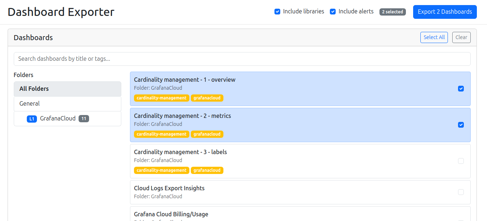
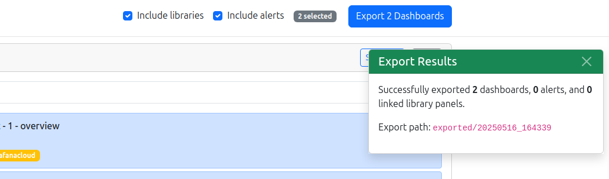

# Grafana Exporter


A Go application with a web UI to export Grafana dashboards and their linked libraries.

## Features

- Web-based interface for selecting dashboards to export
- Automatically exports linked library panels
- Preserves folder structure for dashboards and libraries
- Supports nested folder hierarchies
- Search and filter capabilities
- Works with Grafana v9.x and v10.x+

### Example



## Requirements

- Go 1.18 or higher
- Access to a Grafana instance
- Grafana API key with viewer permissions

## Installation

### From Packages

Download the appropriate package for your system from the [releases page](https://github.com/fulgerx2007/grafana-exporter/releases):

- `.deb` package for Debian/Ubuntu
- `.rpm` package for RHEL/CentOS/Fedora
- `.exe` for Windows
- Binary files for other Linux distributions

### From Source

```bash
git clone https://github.com/yourusername/grafana-exporter.git
cd grafana-exporter
go mod download
go build
```

## Configuration

Create a `.env` file based on the example:

```
GRAFANA_URL=https://your-grafana-instance
GRAFANA_API_KEY=your-api-key-here
SKIP_TLS_VERIFY=true
EXPORT_DIRECTORY=./exported
SERVER_PORT=8080
GRAFANA_VERSION=10.0
```

## Usage

1. Start the application:

```bash
./grafana-exporter
```

2. Open your web browser and navigate to:

```
http://localhost:8080
```

3. Use the web interface to:
   - Browse available folders and dashboards
   - Select dashboards to export
   - Export dashboards and their linked libraries

## Creating a Grafana API Key

1. In your Grafana instance, go to:
   - Configuration > API Keys (Grafana < v9)
   - Administration > API Keys (Grafana v9+)
   - Administration > Service accounts (Grafana v10+)

2. Add a new API key with `Viewer` role permission

3. Copy the generated API key to your `.env` file

## Export Format

Exported files maintain the original folder structure:

```
exported/
  ├── 20240228_123045/          # Timestamp of export
  │   ├── dashboards/
  │   │   ├── General/          # General folder
  │   │   │   └── Dashboard1.json
  │   │   └── FolderName/       # Named folders
  │   │       └── Dashboard2.json
  │   └── libraries/
  │       ├── General/          
  │       │   └── Panel1.json
  │       └── FolderName/       
  │           └── Panel2.json
```

## Docker Support

```bash
docker build -t grafana-exporter .
docker run -p 8080:8080 --env-file .env -v $(pwd)/exported:/app/exported grafana-exporter
```

## License

This project is licensed under the MIT License - see the LICENSE file for details.